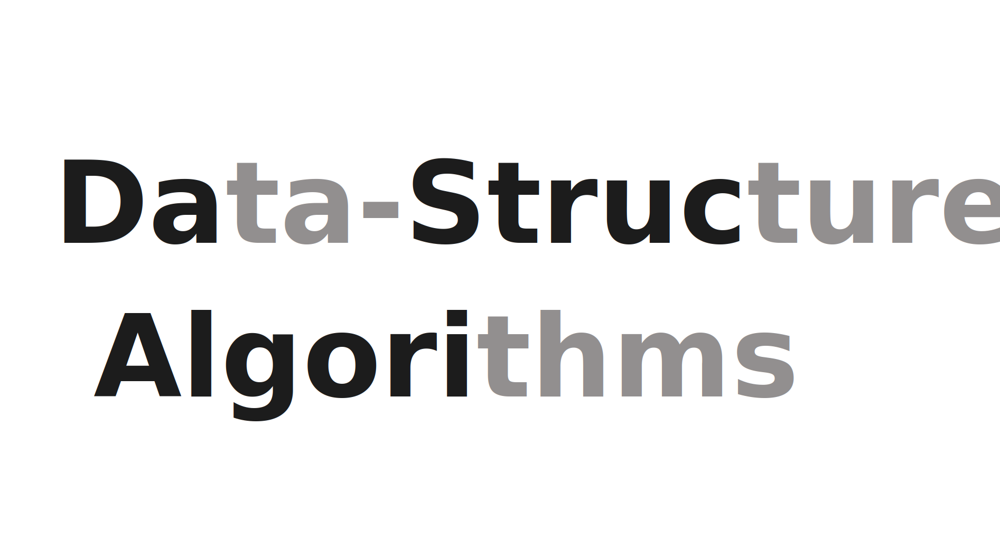

<h1 align="center">Getting Started with Data Structures and Algorithms</h1> 
<br>

<div align="center">

[](https://github.com/utkarsh1504)
[](https://github.com/utkarsh1504/DSA-Java)


</div>

<div align="center">
  
</div>

<br>

<div align="center">
  
  
  
  
  
  
  
  
  
</div>

<p align="center">
  <b>A learning purpose website for everyone to learn Data Structures and Algorithms at one place in a very simple way using the language Java.</b>
</p>

<h2>Table of Contents</h2>
<ol>
    <li><a href="#about">About</a></li>
    <li><a href="#getting-started">Getting Started</a></li>
    <li><a href="#request-docs">Lesson Requests</a></li>
    <li><a href="#contribute">Contributing</a></li>
    <li><a href="#prs">Pull Requests</a></li>
    <li><a href="#license">License</a></li>
</ol>

## **About**

We are building a site which will contain all the DS-Algo related things. It will contain just the relevent concepts which are needed to get started from stratch to go upto it's hard parts. It will also contains some assigment question from different-different platforms. It is completely free, open-sourced, everyone can use it to learn, taking notes, doing revision, making tutorial etc. That's all the goal is.

## **Getting Started**

For the quick start, you can follow the steps below:

1. Star <a href="https://github.com/utkarsh1504/DSA-Java" title="this">this</a> repository.
2. Fork <a href="https://github.com/utkarsh1504/DSA-Java" title="this">this</a> repository.
3. Clone the **forked** repository.
4. Set <a href="https://github.com/utkarsh1504/DSA-Java" title="this">this</a> repository as upstream repository. 

```yml
git clone https://github.com/<your-github-username>/DSA-Java
```
Set upstream command
```yml
git remote add upstream https://github.com/Utkarsh1504/DSA-Java.git
```

3. Navigate to the project directory.

```py
cd DSA-Java
```

4. Create a new branch.

```yml
git checkout -b <your_branch_name>
```

Run the following command to install the required dependencies.

1. `npm install --global gatsby-cli` - make sure you're on Gatsby v2+
   - See [docs here](https://next.gatsbyjs.org/docs/) if you need help
2. `npm install` - install the required dependencies
3. `npm run dev` - start the development server
4. Open http://localhost:8000 in your browser

5. <a href="/CONTRIBUTING.md">Contribute</a>

6. Stage your changes and commit

```yml
git add .

git commit -m "<your_commit_message>"
```

7. Push your local commits to the remote repo.

```yml
git push -u origin <your_branch_name>
```

8. Create a <a href="https://docs.github.com/en/github/collaborating-with-pull-requests/proposing-changes-to-your-work-with-pull-requests/creating-a-pull-request" title="Pull Request">Pull-Request</a> to `main`.

9. Congratulations! 🎉 you've made your contribution to <a href="https://github.com/utkarsh1504/DSA-Java" title="DSA-Java">DSA-Java</a>. ✌️ ❤️ 💥

<h2 id="contribute">Contributing</h2>
<p>
   Thank you for your interest in contributing to our Repo! Pull requests are welcome. For fixing typos, please make a PR with your fixes. For other contributions, we suggest you to read our <a href="/CONTRIBUTING.md">contribution guidelines</a> to see how you can contribute to this project. We are happy for every contribution. 
    
</p>

<h2 id="prs">Issues & Pull Requests</h2>

Before making pull requests please look at our contributing guidelines. You can start working on the issue which are mentioned in issues section. Just drop a comment before working on the issue. Thank you!

<h2 id="license">License</h2>

The **code** is this repo is licensed under the Apache 2.0 license. Feel free to use and share it as per the license.

<br>

<div align="center">
 
 
</div>
