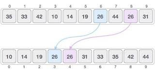

Sorting is an everyday tool for programmers.We need to sort many things for many reasons.Like sorting to age,price etc.So
there are many sorting algorithms  like Merge Sort , Quick Sort, Bubble sort etc. 
## **Stable & Unstable Sorting**
If Two elements in  array has same value, After sorting two things can happen. 
1. They  exchange their relative position.
2. They don't exchange their relative position.


From this example we can see that two '26' doesn't replace their relative positions.Hence it is 
stable sorting algorithms. 
Merge Sort ,Bubble Sort, insertion sort are actually stable sorting algorithm.
On the other hand,Heap Sort, Quick Sort etc are unstable sorting algorithms.

## **Bubble Sort** 
Bubble Sort is the simplest algorithm. This is named Bubble Sort because its element just swap
one by one.
It doesn't have any special use in sorting.It is actually used for educational purposes to introduces
sorting algorithms. I'm actually sorry if I disappointed you. Sort your emotions then. 


<ul>
Suppose we have an array of 3 numbers [3,6,2] which should be sorted in incrementing order. We can use Bubble Sort
Algorithms to do so. 
<li>
At first, we have to take the first element of the array and compare it to the rest of the
elements.If we get any elements lower than it, we will swap the position.
Comparison 1:  3 > 6 ->NO 
</li>

<li>
Comparison 2:  3 > 2
->YES swap the positions Then the array will be [2,6,3]

</li>
<li>
Comparison 3: 6>3 -> YES swap the positions Then the array will be [2,3,6] 

</li>
</ul>
Boom, We have sorted the array.Now let's try to do this in Java.

## **Bubble Sort Function**
```java 
void bubbleSort(int array[], int length){

    for(int i = 0; i < length-1; i++){
        for(int j = i+1; j < length-1; j++){
            //first loop is used to check to the (length-1)th index of the aray
            //second loop is used to check the following items of the arrays
            int temp;
            if(array[i]<array[j]){
                temp = array[i];
                array[i]=array[j];
                array[j]=temp;
        }
    }
 }

```

## **Complete Program In Java**
```java 
public class Main {
  static int array[] = {2, 1, 6, 5, 4};


    public static void main(String[] args) {

        int length = array.length;
        System.out.println("Unsorted Array");

        for (int i = 0; i < length; i++) {
            System.out.println(array[i]);
        }
        
        System.out.println("Unsorted Array");
        bubbleSort(array, length);


    }

    public static void bubbleSort(int array[], int length) {

        for (int i = 0; i < length - 1; i++) {
            for (int j = i + 1; j < length ; j++) {
                //first loop is used to check to the (length-1)th index of the aray
                //second loop is used to check the following items of the arrays
                int temp;
                if (array[i] > array[j]) {
                    temp = array[i];
                    array[i] = array[j];
                    array[j] = temp;
                }
            }
        }
        //for printing

        for (int i = 0; i < length; i++) {
            System.out.println(array[i]);
        }
    }
}

```
## **Time Complexity**
Now talk about the time complexity of this algorithm.From the coding algorithm that is clear that we have to use a loop and 
a nested loop. So the complexity becomes O(n*n).

## **Space Complexity**
Here Space complexity is O(1). We just have to make a temp variable which is updated throughout the loop and doesn't need to
create anything new.

