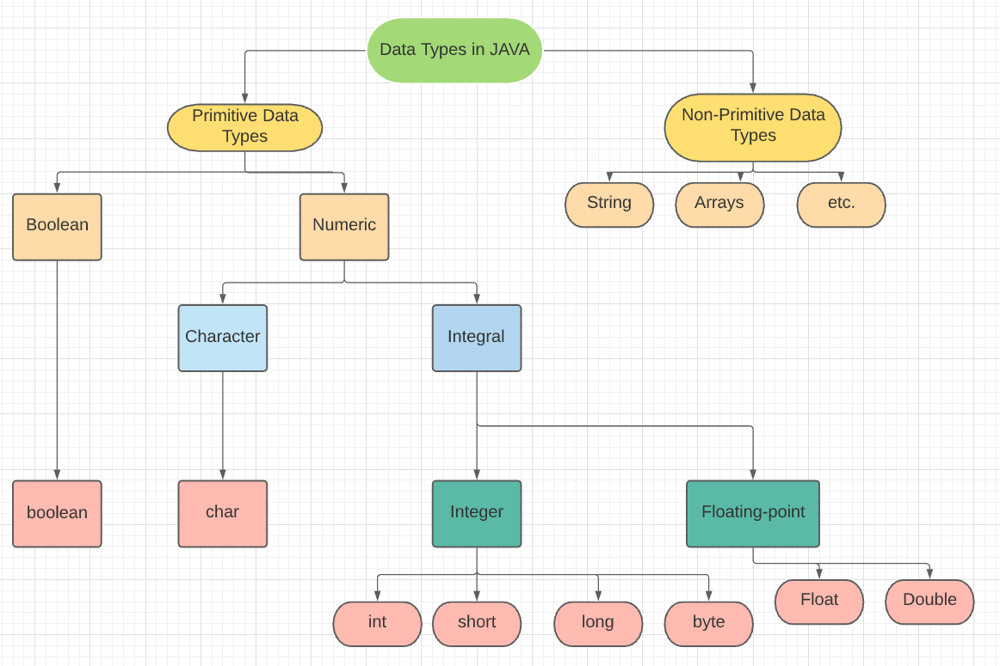

Before getting into data types, let's first familiarize ourselves with variables and constants.

## Variable

Simply, Variable are placeholder for some data values. when we are creating a variable we are just
reserving some memory
locations or reserving some space in memory to store values. In C++, there are different types of variables,eg:

- **int** stores integers such as 7 or -3.
- **float** - stores decimal numbers, such as 7.33 or -3.77.
  etc.

## Constant

As its name suggest **constant**- which does not change, they remain fixed. Basically these are fixed values which
do not change and it must have to be initialized at the time of creation, we can not assign any new values to
it later. That's why these are called **literals**, cuz it can not be modified.

## Data Types

Data types are important because each programming language needs different types of data like integers and
strings, and these data are stored as that data type. Data types are used to define a variable before to use in a
program, its a constrains that a expression, such as variable or a function, might take.
In Java, whenever a variable is defined, the compiler(which compiles source code written in a high-level language(Java)
into a set of machine-language that can be understood by a digital computer's CPU) allocates some memory for that
variable based on their data-type. It has some types:



There are two types of data types in Java:

1. **Primitive data types**: The primitive data types include boolean, char, byte, short, int, long, float and double. These are pre defined or they are the most basic structure for building more sophisicated data types.they always have a value.

2. **Non-primitive data types**: The non-primitive data types or reference data types include Classes, Objects, Interfaces, Strings, and Arrays. They have null as default value.

In Java, all variables must be declared first before they can be used.

# Primitive Data-Type 

These are the building blocks of data manipulation. In Java, these are the most basic data types. 

These are of `8 types`:

|Data Types   |Default Value    |Default Size   |
|-------------|-----------------|---------------|
|boolean      |false            |1 bit          |
|char         |'\u0000'         |2 byte         |
|byte         |0                |1 byte         |
|short        |0                |2 byte         |
|int          |0                |4 byte         |
|long         |0L               |8 byte         |
|float        |0.0f             |4 byte         |
|double       |0.0d             |8 byte         |

1. **Boolean Data Type** : Variables declared with boolean data type can store only true/false. These are used as flag which checks for a particular conditions. Its size is only 1 bit.
```java
boolean a = false;
```
2. **Byte Data Type** : It is 8-bit signed 2's complement integer. Its value-range lies between -128 to 127 (inclusive). Its default value is 0. The byte data type is used to save memory in large arrays where the memory savings is most required. It saves space because a byte is 4 times smaller than an integer. It can also be used in place of "int" data type.
```java
byte a = 10;
byte b = -20;
``` 
3. **Short Data Type** : It is a 16-bit signed 2's complement integer. Its value-range lies between -32,768 to 32,767 (inclusive). Its default value is 0. A short data type is 2 times smaller than an integer.
```java
short a = 10000;
short b = -5000;  
```
4. **Int Data Type** : It is a 32-bit signed 2's complement integer. Its value-range lies between - 2,147,483,648 (-2^31) to 2,147,483,647 (2^31 -1) (inclusive). Its default value is 0. It is generally used as a default data type for integral values.
```java
int a = 100000; 
int b = -200000;
```
5. **Long Data Type** : It is a 64-bit 2's complement integer. Its value-range lies between -9,223,372,036,854,775,808(-2^63) to 9,223,372,036,854,775,807(2^63 -1)(inclusive). Its default value is 0. The long data type is generally used when the integer that we have to store exceeds the range provided by int data type.
```java
long a = 100000L;
long b = -200000L; 
```
6. **Float Data Type** : It is a single-precision 32-bit IEEE 754 floating point.Its value range is unlimited. It is recommended that we should use float (instead of double) if yweou need to save memory in large arrays of floating point numbers. It should never be used for precise values, such as currency. Its default value is 0.0F.
```java
float f1 = 234.5f ;
```
7. **Double Data Type** : It is a double-precision 64-bit IEEE 754 floating point. Its value range is unlimited. This is also generally used for decimal values just like float. The double data type also should never be used for precise values, such as currency. Its default value is 0.0d.
```java
double d1 = 12.3;
```
8. **Char Data Type** : It is a single 16-bit Unicode character. Its value-range lies between '\u0000' (or 0) to '\uffff' (or 65,535 inclusive). It is used to store characters.
```java
char letterA = 'A';
``` 

# Non-Primitive Data-Type

These are created by programmers, unlike primitive data types which are already built-in. These are used to store a group of values for eg, Arrays, in arrays we store a group of data, another eg is list. Therefore, these are also known as advanced data types in Java. When we define a variable of non-primitive data types, it references a memory location where data is stored in the heap memory. That's why, a non-primitive data type is also known as reference data type in Java or simply object reference variable.

Non-Primitive data types are created by instantiation, i.e, an object is created. This object reference variable lives on the stack memory and the object to which it points always lives on the heap memory. The stack holds a pointer to the object on the heap.

This object can have more than one reference variable, and if we make changes on the data of the object through one reference variable the actual object gets changed and this changed objects's data is changed in all the variables that are pointing(or referencing) to this object.

Let's see some of its types:

1. **Class** : Every class is considered as user-defined data type as a user creates a class. In Java programming, a class is basically a user-defined data type that act as a template for creating objects of identical type. It represents the common properties and actions (functions) of an object.
```java
public class GitHub
 { 
   // class body.
 }
 ```
2. **Object** : An object is any real-world thing that has some properties and actions. In other words, an entity that has state and behavior is known as an object. An Object has three characterstics - State, Behaviour and Identity.
```java
Person p = new Person();
```
3. **String** : A String is also a class. It represents a sequence of characters like Shuaib, A123, etc. The simplest way to create a string object is by storing sequence of characters into string type variable.
```java
String str = "India";
```
4. **Arrays** : It is an Object which is used to store multiple data of same data type. It can store Primitive as well as Non-Primitive data in it. 
```java
int [] numbers;
Student [] x; // Student is a name of class.
```
5. **Interface** : An interface is declared like a class but the only difference is that it contains only final variables and method declarations. It is a fully abstract class. It is blue print of a class. It is mechanism in Java to achieve abstraction and multiple inheritance. There can only be abstract methods and variables and no method body.
```java
interface printnum{
    void print();
}
```
