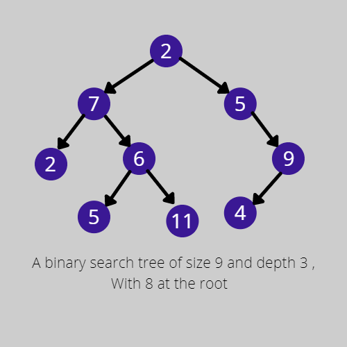

### Binary Search Tree
A Binary Search Tree is a binary tree that additionally satisfies the binary search property.

### Binary Tree Property 
This property states that the key in each node must be greater than or equal to any key stored in the left sub-tree and less than or equal to any key stored in the right sub-tree.



## Operations In BST

### Searching
1. We begin by examining the root node. If the tree is null , the key we are searching for does not exist in the tree.
2. If the key equals that of the root If the key is equal that of route the search is successful and we return the node .
3. If the key is less than that of the root we search the left subtree. Similarly, if the key is greater than that of the root, we search the right subtree.
4. This process is repeated until the key is found or the remaining subtree is null.
5. If the search key is not found after a null subtree is reached, then the key is not present in the tree.

### Insertion
To insert for a key in the tree , we follow the binary search property and insert accordingly.
1. Compare the key to be searched with the root key.
2. If the key is lesser than the roots value, we return the left subtree of the node.
3. If the key is greater than the roots value, we return the right subtree of node.
4. This process continued until we hit a leaf node. The new node is inserted to this location as a new node.

### Deletion
When removing a node from a binary search tree it is mandatory to maintain the in-order sequence of the nodes.
There are three possible cases to consider:
1. Deleting a node with no childeren :simply remove the node from the tree 
2. Deleting a node with one child: remove the node and replace it with its child.
3. Deleting a node with two children: First we find the inorder successor of the node. <br>
Then the contents of this in-order successor are copied to the node to be deleted.
Finally, the in-order successor is deleted
<br>

Let's see the implementation of Binary Search Tree using an example:

```java
// Java implementation of recursive Binary Search
class BinarySearch {
    // Returns index of x if it is present in arr[l..r],
    // else return -1
    int binarySearch(int arr[], int l, int r, int x)
    {
        if (r >= l) {
            int mid = l + (r - l) / 2;
  
            // If the element is present at the
            // middle itself
            if (arr[mid] == x)
                return mid;
  
            // If element is smaller than mid, then
            // it can only be present in left subarray
            if (arr[mid] > x)
                return binarySearch(arr, l, mid - 1, x);
  
            // Else the element can only be present
            // in right subarray
            return binarySearch(arr, mid + 1, r, x);
        }
  
        // We reach here when element is not present
        // in array
        return -1;
    }
  
    // Driver method to test above
    public static void main(String args[])
    {
        BinarySearch ob = new BinarySearch();
        int arr[] = { 2, 3, 4, 10, 40 };
        int n = arr.length;
        int x = 10;
        int result = ob.binarySearch(arr, 0, n - 1, x);
        if (result == -1)
            System.out.println("Element not present");
        else
            System.out.println("Element found at index " + result);
    }
}
```
Output : 
```
Element is present at index 3
```

## Visualisations 
[BinarySearch Visualisation](https://www.cs.usfca.edu/~galles/visualization/BST.html)
