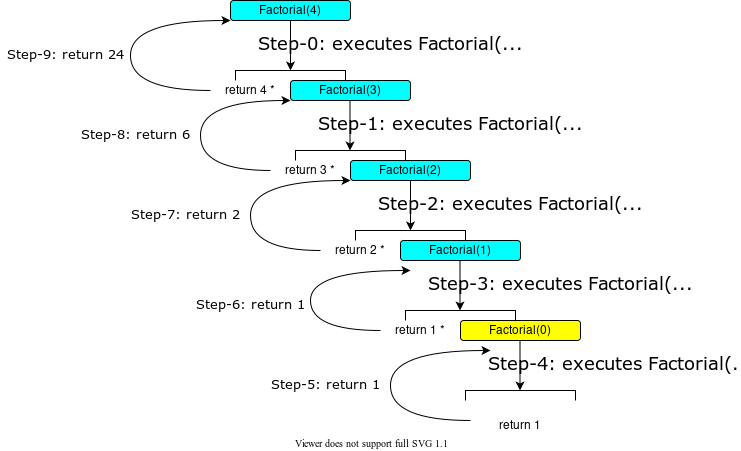

Recursion is a technique that leads to elegant solutions to problems that are difficult to solve using simple iteration(loops). In some cases, it enables
you to develop a natural, straightforward, simple solution to an otherwise difficult problem.

> Recursion in Computer Science is a method where the solution to a problem depends on the solution to smaller instances of the same problem.

This lesson introduces the concepts and techniques of recursive programming and illustrates with examples of how to **“think recursively”**. Let's understand this by a simple example:

```java
    Calculate factorial of a number by using recursion
```

Now, How do you find `n!` of a given number?

- To find `1!` is easy, because you know that `0!` is 1, and 1! is 1 × 0!.
- Assuming that you know `(n - 1)!`, you can obtain n! immediately by using `n × (n - 1)!`. Thus, the problem of computing n! is reduced to computing (n - 1)!. When computing `(n - 1)!`, you can apply the same idea recursively until n is reduced to 0.
- Let factorial(n) be the method for computing n!. If you call the method with n = 0, it immediately returns the result. The method knows how to solve the simplest case, which is referred to as the **base case** or the stopping condition.
- If you call the method with n > 0, it reduces the problem into a subproblem for computing the factorial of n - 1.
- The subproblem is essentially the same as the original problem, but it is simpler or smaller. Because the sub-problem has the same property as the original problem, you can call the method with a different argument, which is referred to as a recursive call.
- The recursive algorithm for computing factorial(n) can be simply described as follows:

```java
    if(n == 0){
        return 1;
    }else{
        return n * factorial(n - 1);
    }
```

A recursive call can result in many more recursive calls, because the method keeps on dividing a subproblem into new subproblems. For a recursive method to terminate, the problem must eventually be reduced to a stopping case, at which point the method returns a result to its caller. The caller then performs a computation and returns the result to its own caller. This process continues until the result is passed back to the original caller. The original problem
can now be solved by multiplying `n` by the result of **factorial(n - 1)**.

```java
    import java.util.Scanner;

    public class CalculateFactorial {
    /** Main method */
        public static void main(String[] args) {
        // Create a Scanner
            Scanner input = new Scanner(System.in);
            System.out.print("Enter a nonnegative integer: ");
            int n = input.nextInt();
            
            // Display factorial
            System.out.println("Factorial of " + n + " is " + factorial(n));
        }

        /** Return the factorial for the specified number */
        public static long factorial(int n) {
            if (n == 0) // Base case
                return 1;
            else
                return n * factorial(n - 1); // Recursive call
        }
    }
```
##### Output:
```yml
eg-1:
Enter a nonnegative integer: 4
Factorial of 4 is 24 

eg-2:
Enter a nonnegative integer: 10
Factorial of 10 is 3628800
```
The `factorial` method is essentially a direct translation of the recursive mathematical definition for the factorial into Java code. The call to factorial is recursive
because it calls itself. The parameter passed to factorial is decremented until it reaches the base case of 0. You see how to write a recursive method. How does recursion work behind the scenes? Below diagram illustrates the execution of the recursive calls, starting with n = 4.



```java
public static long factorial(int n) {
    return n * factorial(n - 1);
 }
```
The example discussed in this section shows a recursive method that invokes itself. This is known as direct recursion. It is also possible to create indirect recursion. This occurs when method A invokes method B, which in turn invokes method A. There can even be seeral more methods involved in the recursion. For example, method A invokes method B, which invoke method C, which invokes method A.
