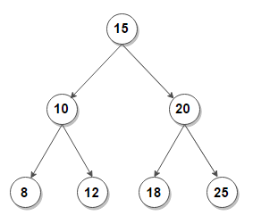
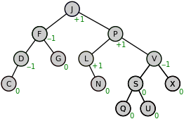
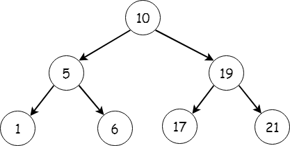

 Introduction to trees

Tree is a non-linear data structure which organises data in hierarchical form  and is recursive in nature. It is a popular data structure used in wide range of applications. Every element is considered as a node which has a predecessor and a successor. Trees are further classified into many types I.e, Binary Tree, Complete Binary Tree, Perfect Binary Tree etc. 

## Structure of Tree

Structure of this Data Structure is clearly mentioned by its name which is in the form of a Tree. Every circle here represents a node.  Let’s understand them better with the help of the diagram below 

**Root** - Initial node of a tree , which divides the tree into n numbers.

**Parent Node** - The Predecessor of every node is its parent node. As D here is the parent of H & I.

**Child Node** - The successor of every node is its child node. Here, H & I are the successors of D. 

**Siblings** - Nodes at the same levels are considered as siblings. 

**Leaf nodes** - The nodes having no successors are the one’s which are considered as leaves.

**Right Sub-tree** - Nodes at the right side of the root node are the one’s of right sub-tree.

**Left Sub-tree** - Nodes at the left side of the root node are the one’s of left sub tree.

## Types of Trees

Their are in basic 4 types of Trees 

### *Binary Tree 

Binary tree is the one whose every parent node has atmost 2 children. Number of child nodes can be either 0,1 or 2. 
Binary Trees can further be classified into more types given below in the diagram.

### *Binary Search Tree 

BST is a lot similar to a binary tree  in which every parent node has at most 2 children. Other than that, BST follows few properties which makes it different from a binary tree. 

The properties are - 
* Value in all the nodes of a left subtree should be lesser than the value in the root node.
* Value in all the nodes of a right subtree should be larger than the value in the root node.

The pictorial representation of BST is 

### *AVL Tree 

AVL trees are considered as the variants of binary tree which have the characteristics of both Binary tree and Binary search tree. These trees are self-balanced which means the height of left sub tree and right are sub tree are equal. This balanced is measured in terms of balancing factor. 

Now, let’s understand what is a balancing factor - 
* It is the difference between the left sub tree and right sub tree.
* The value of balancing factor must be 0 , -1 and 1 , which means each node will be having a balancing factor of 0,1 and -1.
* Values of nodes other than -1, to 1 in an AVL tree will represent an unbalanced tree that needs to be balanced.
* If a node has a balance factor of 1, it means that the left subtree is one level higher than the right subtree.
* If a node has a balance factor of 0, it means that the height of the left subtree and the right subtree is equal.
* If a node has a balance factor of -1, it means that the right subtree is one level higher than the left subtree or the left subtree is one level lower than the right subtree.

### *B-Tree 

It is also known as height-balanced m way tree, where m is the order of the tree. B-tree is more generalised form of a binary search tree.  In the case of a binary tree, the leaf nodes might not be at the same level. However, in the case of a B Tree, all the leaf nodes should be at the same level. 

Properties of B-Tree are -
* The root may have between 2 and m children.
* All other nodes must have between [M/2] and m children.
* A node that has k children will have k-1 key values.
* Thus, the root may have only 2 children; all other nodes must be at least half full .

## Traversals in Trees

Tree traversals means traversing or visiting each node of the tree. Other than tree data structure, Stack , Queue and Linked List only have one way for traversing which makes Trees different from them also. 

Traversals are of 3 types 

1. **In-order Traversal** - This traversal calls for the sequence of LEFT, ROOT, RIGHT. 
2. **Pre-order Traversal** - This traversal calls for the sequence of ROOT ,LEFT, RIGHT.
3. **Post-order traversal** - This traversal calls for the sequence of LEFT, RIGHT, ROOT.

Now let’s understand these a help of an example

Taking the above tree into consideration let's understand how  traversing is done

**In-order Traversal (LEFT , ROOT, RIGHT)** - Traverse the left sub-tree , visit the root , traverse the right sub-tree which makes the sequence (1,5,6,10,17,19,21)

**Pre-order traversal (ROOT, LEFT , RIGHT)** - Visit the root , Traverse the left sub tree , Traverse the right sub tree which makes the sequence (10,5,1,6,19,17,21)

**Post-order traversal (LEFT,RIGHT,ROOT)** - Traverse the left sub tree , Traverse the right sub-tree , visit the root which makes the sequence (1,6,5,17,21,19,10)
