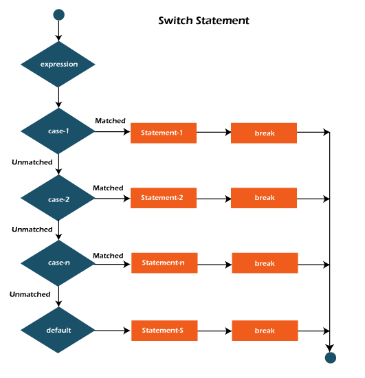

Okay so let's learn about the control flow of a Java program.

```java
    // Java program to demonstrate the control flow

    public class <ClassName> {
        public static void main(String[] args){
            System.out.println("Hello World");
        }
    }
```

Let's go through the code line by line.

- **``public static void main(String[] args)``** Java main method is the entry point of any Java program. You can only change the name of String array argument, for example you can change ``args`` to ``myStringArgs``.
- **``public``** This is the access modifier of the main method. It has to be ``public`` so that Java Runtime Environment(JRE) can execute this method. Remember that if you make any method non-public then it’s not allowed to be executed by any program, there are some access restrictions applied. So it means that the main method has to be public.
- **``Static``** When JRE starts, there is no object of the class present. That’s why the main method has to be static so that JVM can load the class into memory and call the main method. If the main method won’t be static, JVM would not be able to call it because there is no object of the class is present.
- **``Void``** Java programming mandates that every method provide the return type. Java main method doesn’t return anything, that’s why it’s return type is void. This has been done to keep things simple because once the main method is finished executing, java program terminates. So there is no point in returning anything, there is nothing that can be done for the returned object by JVM. If we try to return something from the main method, it will give compilation error as an unexpected return value.
- **``Main``** method is similar to the main function in C and C++.
The ``main`` method accepts a single argument: an array of elements of type String.
- **``String[] args``** Java main method accepts a single argument of type String array. This is also called as java command line arguments.
- **``System.out.println("Hello, World");``** Outputs the string “Hello, World” followed by a new line on the screen.Output is actually accomplished by the built-in println( ) method. ``System`` is a predefined class that provides access to the system, and ``out`` is the variable of type output stream that is connected to the console.

> System, out, println these are default classes and methods built into Java. If you want to read docs do a `ctrl+click` (IntelliJ Idea) on them.
> 
Okay that's a lot of information to digest and it is the basic for a Java program. Now let's move on to the next section.

## **If-Else Statements**

If-else statements are used to execute different code depending on the value of a variable. We use If-else statements for the condition based problem solving. If we have given a choice, then we can use if-else statements to decide which code to execute and it is called conditional execution.

It will be really easy to understand as we will see in the following example.

#### Syntax

if-else statements are written as follows.

```java
    // syntax
    if (condition) {
        // Code to execute if condition is true
    }
    else {
        // Code to execute if condition is false
    }
```

so above is the basic syntax of if-else statements. let's see some of the examples to understand it better.
we will see some simple examples and in last of this section i will link some more question so you can practise them on your own.

```java
    // program to check the greater number of the two.

    public class <ClassName> {
        public static void main(String[] args){
            int a = 10;
            int b = 20;
            if(a > b){
                System.out.println("a is greater than b");
            }
            else{
                System.out.println("b is greater than a");
            }
        }
    }
```

Lets go through the if-else code line by line.

- `if` is the keyword that indicates that the code block is an if statement. `(a > b)` is the condition. we can have multiple conditions in a single if statement. we're checking if `a` is greater than `b` if this turn out to be true then the code block under the if statement will be executed, if not then we'll move on the next statement.
- `else if` is the keyword that indicates that the code block is an else if statement. `(a < b)` is the condition. else if is used to check if the condition is true then the code block under the if statement will be executed, if not then we'll move on the next statement. it is used when we have multiple conditions in a single if statement.
- `else` is the keyword that indicates that the code block is an else statement. if the condition from the above statements are turn out to be false then the code block under the else statement will be executed.

ok so that's all. now let's see some more examples.

```java
    //A Java Program to demonstrate the use of if-else statement.  
    //It is a program of odd and even number.  
    public class IfElseClass {  
        public static void main(String[] args) {  
        //defining a variable  
        int number = 13;  
        //Check if the number is divisible by 2 or not  
        if(number % 2 == 0){  
            System.out.println("even number");  
        }
        else{  
            System.out.println("odd number");  
        }  
    }  
}  
```

Let's go through the code line by line.

- `if` is the keyword that indicates that the code block is an if statement. `(number%2==0)` is the condition. we can have multiple conditions in a single if statement. we're checking if  ``number`` is divisible by ``2``  if this turn out to be true then the code block under the if statement will be executed, if not then we'll move on the next statement.
- `else` is the keyword that indicates that the code block is an else statement. if the condition from the above statements are turn out to be false then the code block under the else statement will be executed.


## **Switch Statements**

Switch statements are used to execute different code depending on the value of a variable. We use Switch statements for the condition based problem solving. Switch statements are used when we have multiple conditions in a single if statement. It is just a substitute for multiple if-else statements. In this a variable is compared to multiple cases one by one and when the case is matched then the code block under that case will be executed.

#### Syntax

```java
    // syntax

    switch (expression) {
        case value1:
            // code to execute if expression is value1
            break;
        case value2:
            // code to execute if expression is value2
            break;
        default:
            // code to execute if expression is not value1 or value2
            break;
    }
```
Above is the basic syntax of switch statements. This is how it works:
- The switch expression is only evaluated `once`.
- The value of the expression is `compared` with the values of each case value.
- If there is a `match`, ie. the case value and the switch expression are same, the associated block of code with the case value is executed.
- The `break` and `default` keywords are optional and will be explained ahead.

Now, let us see a diagramtic workflow of the Java Switch statement for a better understanding.



Let us see an example to understand it better.

```java
    // Program to check Vowel or Consonant: 
    // It is not case-sensitive.

    public class <ClassName> {
        public static void main(String[] args){
            char ch='O';  
            switch(ch)  
            {  
                case 'a':   
                    System.out.println("Vowel");  
                    break;  
                case 'e':   
                    System.out.println("Vowel");  
                    break;  
                case 'i':   
                    System.out.println("Vowel");  
                    break;  
                case 'o':   
                    System.out.println("Vowel");  
                    break;  
                case 'u':   
                    System.out.println("Vowel");  
                    break;  
                case 'A':   
                    System.out.println("Vowel");  
                    break;  
                case 'E':   
                    System.out.println("Vowel");  
                    break;  
                case 'I':   
                    System.out.println("Vowel");  
                    break;  
                case 'O':   
                    System.out.println("Vowel");  
                    break;  
                case 'U':   
                    System.out.println("Vowel");  
                    break;  
                default:   
                    System.out.println("Consonant"); 
                    break;
            }
        }
    }
    
    Output : Vowel
```
#### The 'break' Keyword
- When the Java compiler reaches a `break` keyword, it breaks out of the switch block.
- This will stop the execution of more code and case testing inside the block.
- Basically it means that When a match is found, and the job is done, there is no need for more testing. Hence we break out of the switch statement.

#### The 'default' Keyword
- The `default` keyword specifies some code to run if there is no case match:

Now let us see another example where there are no break statements present:

```java
    //switch cases without break statements

    public class SwitchExample2 {  
        public static void main(String[] args) {  
            int num = 20;  
            switch(num){  
                case 10: 
                    System.out.println("10");  
                case 20: 
                    System.out.println("20");  
                case 30: 
                    System.out.println("30");  
                default:
                    System.out.println("The number is not 10, 20 or 30");  
            }  
        }  
    } 
    
    Output : 20
             30
             The number is not 10, 20 or 30
```
Remember that the switch statement is `fall-through`. That's why all the statements got executed after the first match because the break statement is NOT present.

#### Points to Remember
- There can be 1 or N number of `case values` for a switch expression.
- The `case values` must be `literal` or `constant`. It doesn't allow variables.
- The `case values` must be `unique`. In case of duplicate value, it renders compile-time error.
- The Java `switch expression` must be of `byte, short, int, long` (with its Wrapper type), `enums and string`.
- Each case statement can have a `break` statement which is `optional`. When control reaches to the break statement, it jumps the control after the switch expression. If a break statement is `not found`, it executes the next case.
- The case value can have a `default` label which is `optional`.
- The Java switch statement is `fall-through`. It means it executes all statements after the first match if a break statement is NOT present.

#### Java Nested Switch Statements
We can use switch statement inside other switch statement in Java. It is known as nested switch statement.

```java
    //Java Program to demonstrate the use of Java Nested Switch  

    public class NestedSwitchExample {    
        public static void main(String args[])  
          {  
            //C - CSE, E - ECE, M - Mechanical  
            char branch = 'C';                 
            int collegeYear = 4;  
            switch(collegeYear)  
            {  
                case 1:  
                    System.out.println("English, Maths, Science");  
                    break;  
                case 2:  
                    switch( branch )   
                    {  
                        case 'C':  
                            System.out.println("Operating System, Java, Data Structure");  
                            break;  
                        case 'E':  
                            System.out.println("Micro processors, Logic switching theory");  
                            break;  
                        case 'M':  
                            System.out.println("Drawing, Manufacturing Machines");  
                            break;  
                    }  
                    break;  
                case 3:  
                    switch(branch)   
                    {  
                        case 'C':  
                            System.out.println("Computer Organization, MultiMedia");  
                            break;  
                        case 'E':  
                            System.out.println("Fundamentals of Logic Design, Microelectronics");  
                            break;  
                        case 'M':  
                            System.out.println("Internal Combustion Engines, Mechanical Vibration");  
                            break;  
                    }  
                    break;  
                case 4:  
                    switch(branch)   
                    {  
                        case 'C':  
                            System.out.println("Data Communication and Networks, MultiMedia");  
                            break;  
                        case 'E':  
                                System.out.println("Embedded System, Image Processing");  
                            break;  
                        case 'M':  
                            System.out.println("Production Technology, Thermal Engineering");  
                            break;  
                    }  
                    break;  
            }  
        }  
    } 
    
    Output : Data Communication and Networks, MultiMedia
```

