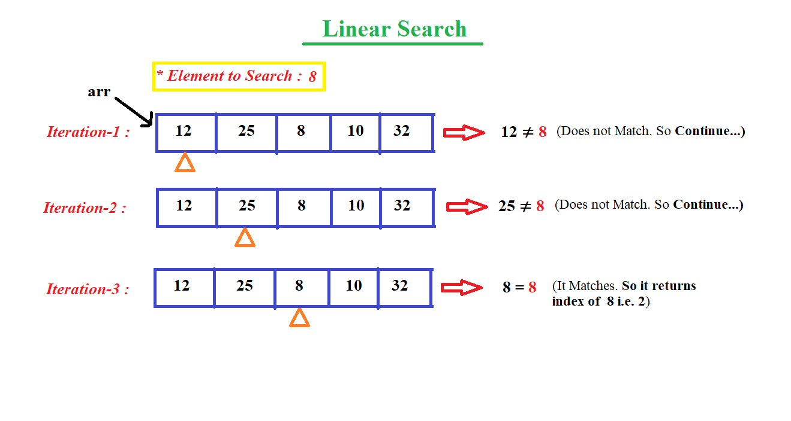

## **What is Searching ?**

Searching is the process of finding some particular element in the list. If the element is present in the list, then the process is called successful and the process returns the location of that element, otherwise the search is called unsuccessful.

## **What is Linear Search ?**

Linear search is the simplest search algorithm and often called sequential search. In this type of searching, we simply traverse the list completely and match each element of the list with the item whose location is to be found. If the match found then location of the item is returned otherwise the algorithm return NULL.

## **Linear Search Algorithm :**

***LINEAR_SEARCH(ARR, N, VAL)***

- **Step 1:** [INITIALIZE] SET POS = -1
- **Step 2:** [INITIALIZE] SET I = 1
- **Step 3:** Repeat Step 4 while I<=N
- **Step 4:** IF ARR[I] = VAL
<br> SET POS = I
<br> PRINT POS
<br> Go to Step 6
<br> [END OF IF]
<br> SET I = I + 1
<br> [END OF LOOP]
- **Step 5:** IF POS = -1
<br> PRINT " VALUE IS NOT PRESENTIN THE ARRAY "
<br> [END OF IF]
- **Step 6:** EXIT



## **Complexity of Algorithm :**

- **Time Complexity :** O(n)
- **Space Complexity :** O(1)

## **Code :**

```java
class LinearSearch
{
    // linear search algorithm 
    public static int linearSearch(int arr[], int n, int val)
    {
        for (int i = 0; i < n; i++)
        {
            if (arr[i] == val)
                return i;
        }
        return -1;
    }
 
    // driver code main method
    public static void main(String args[])
    {
        int arr[] = { 12, 25, 8, 10, 32 };
        int x = 8;
 
        // function call
        int result = linearSearch(arr, arr.length, x);
        if (result == -1)
            System.out.print("Element is not present in array");
        else
            System.out.print("Element is present at index : "+ result);
    }
}
```

## **Output :**

```
Element is present at index : 2
```