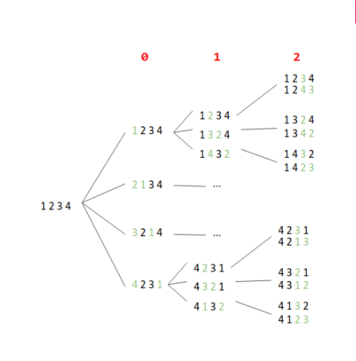
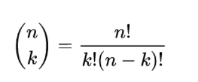

## In this article we are going to discuss some more concepts under *Number Theory*.
<!-- Bit Masking + DP -->
## 1. Bit Masking + Dynamic Programming 

First thing to make sure before using bitmasks for solving a problem is that it must be having small constraints, as solutions which use bitmasking generally take up exponential time and memory.

Let's first try to understand what Bitmask means. Mask in Bitmask means hiding something. Bitmask is nothing but a binary number that represents something. Let's take an example. Consider the set *A={1,2,3,4,5}*. We can represent any subset of *A* using a bitmask of length *5*, with an assumption that if *ith(0<=i<=4)* bit is set then it means ith element is present in subset. So the bitmask *01010* represents the subset *{2,4}*

*Now the benefit of using bitmask. We can set the ith bit, unset the ith bit, check if ith bit is set in just one step each. Let's say the bitmask b = 01010.*

***Set the ith bit*** : b|(1<<i). Let i = 0, so, 


(1<<i) = 00001
01010 | 00001 = 01011

So now the subset includes the 0th element also, the subset is {1,2,4}.

***Unset the ith bit*** : b&!(1<<i). Let i = 1, so

(1<<i) = 00010

!(1<<i) = 11101

00010 & 11101 = 01000

Now the subset does not include the 1st element so the subset now is {4}.

***Checking if the ith bit is set***: b&(1<<i) doing this operation if ith bit is set we will get a non-zero integer other wise a zero.

Let i =3, 

(1<<i) = 01000

01010 & 01000 =  01000

Clearly the result is non-zero so that means 3rd element is present in the subset. 

***Lets take a problem where given a set we have to count how many subsets have sum of elements greater than or equal to a give value.***

Algorithm is simple:
```algorithm 
solve(set, set_size, val)
    count = 0
    for x = 0 to power(2, set_size)
        sum = 0
        for k = 0 to set_size        
            if kth bit is set in x
                sum = sum + set[k]
        if sum >= val
             count = count + 1
    return count
```
To iterate over all the subsets we are going to each number from *0 to 2^(set_size)-1*.
The above problem simply uses bitmask and complexity is *O(N2^(N))*.

##### Assignment Problem:
*There are N persons and N tasks, each task is to be alloted to a single person. We are also given a matrix cost of size NxN , where cost[i][j] denotes, how much person i is going to charge for task j. Now we need to assign each task to a person in such a way that the total cost is minimum. Note that each task is to be alloted to a single person, and each person will be alloted only one task.*

The brute force approach here is to try every possible assignment. Algorithm is given below:

```
assign(N,  cost)
    for i = 0 to N
        assignment[i] = i            //assigning task i to person i
    res = INFINITY
    for j = 0 to factorial(N)
        total_cost = 0
        for i = 0 to N
            total_cost = total_cost + cost[i][assignment[i]]
        res = min(res, total_cost)
        generate_next_greater_permutation(assignment)
    return res
```

The complexity of above algorithm is *O(N!)*, well that's clearly not good.

Let's try to improve it using dynamic programming. Suppose the state of dp is *(k,mask)* , where k represents that person 0 to k-1 have been assigned a task, and mask is a binary number, whose ith bit represents if the ith task has been assigned or not.
Now, suppose, we have answer(k,mask), we can assign a task i  to person k, iff ith task is not yet assigned to any peron i.e. *mask&(i<<i)* = 0  then *answer(k+1,mask|(1<<i))*,  will be given as:

*answer(k+1,mask|(1<<i)) = min(answer(k+1,mask|(1<<i)), answer(k,mask)+cost[k][i])*


One thing to note here is k is always equal to the number set bits in mask , so we can remove that. So the dp state now is just (mask), and if we have answer(mask), then

*answer(mask|(1<<i)) = min(answer(mask|(1<<i)), answer(mask)+cost[x][j])*

here x = number of set bits in mask.
Complete algorithm is given below:

```
assign(N, cost)
    for i = 0 to power(2,N)
        dp[i] = INFINITY
    dp[0] = 0
    for mask = 0 to power(2, N)
        x = count_set_bits(mask)
        for j = 0 to N
            if jth bit is not set in i
                dp[mask|(1<<j)] = min(dp[mask|(1<<j)], dp[mask]+cost[x][j])
    return dp[power(2,N)-1]                

```

Time complexity of above algorithm  is O(N*2^N) and space complexity is O(2^N).
This is just one problem that can be solved using DP+bitmasking. There's a whole lot.
<!-- Bit Masking + DP -->

<!-- Extended Euclidean Algorithm -->


## 2. Extended Euclidean Algorithm

While the Euclidean algorithm calculates only the greatest common divisor (GCD) of two integers a and b, the extended version also finds a way to represent GCD in terms of a and b, i.e. coefficients x and y for which:

ax+by=gcd(a,b)

It's important to note, that we can always find such a representation, for instance, gcd(55,80)=5 therefore we can represent 5 as a linear combination with the terms 55 and 80, 55x3+80x(−2)=5.

#### Algorithm
We will denote the GCD of a and b with g in this section.

The changes to the original algorithm are very simple. If we recall the algorithm, we can see that the algorithm ends with b=0 and a=g. For these parameters, we can easily find coefficients, namely gx1+0x0=g.

Starting from these coefficients (x,y)=(1,0), we can go backwards up the recursive calls. All we need to do is to figure out how the coefficients x and y change during the transition from (a,b) to (b, a mod b).

Let us assume we found the coefficients (x1,y1) for (b,amodb):

*b⋅x1+(amodb)⋅y1=g*

and we want to find the pair (x,y) for (a,b):

*a⋅x+b⋅y=g*

We can represent amodb as:

*amodb=a−⌊a/b⌋⋅b*

Substituting this expression in the coefficient equation of (x1,y1) gives:

*g=b⋅x1+(amodb)⋅y1=b⋅x1+(a−⌊a/b⌋⋅b)⋅y1*

and after rearranging the terms:

*g=a⋅y1+b⋅(x1−y1⋅⌊a/b⌋)*

We found the values of x and y:

*x=y1*

*y=x1−y1⋅⌊a/b⌋*


#### Implementation
```java
class Extended {
    // extended Euclidean Algorithm
    public static int gcdExtended(int a, int b, int x, int y)
    {
        // Base Case
        if (a == 0) {
            x = 0;
            y = 1;
            return b;
        }
  
        int x1 = 1, y1 = 1; // To store results of recursive call
        int gcd = gcdExtended(b % a, a, x1, y1);
  
        // Update x and y using results of recursive
        // call
        x = y1 - (b / a) * x1;
        y = x1;
  
        return gcd;
    }
  
    // Driver Program
    public static void main(String[] args)
    {
        int x = 1, y = 1;
        int a = 35, b = 15;
        int g = gcdExtended(a, b, x, y);
        System.out.print("gcd(" + a + ", " + b + ") = " + g);
    }
}

```


<!-- Extended Euclidean Algorithm -->

<!-- Modulo Muliplicative Inverse  -->

## 3. Modulo Multiplicative Inverse

In modular arithmetic we do not have a division operation. However, we do have modular inverses.
- The modular inverse of A (mod C) is A^-1
- (A * A^-1) ≡ 1 (mod C) or equivalently (A * A^-1) mod C = 1
- Only the numbers coprime to C (numbers that share no prime factors with C) have a modular inverse (mod C)

##### Example: A=3, C=7
- 3 * 0 ≡ 0 (mod 7)
- 3 * 1 ≡ 3 (mod 7)
- 3 * 2 ≡ 6 (mod 7)
- 3 * 3 ≡ 9 ≡ 2 (mod 7)
- 3 * 4 ≡ 12 ≡ 5 (mod 7)
- 3 * 5 ≡ 15 (mod 7) ≡ 1 (mod 7)   <------ ​*FOUND INVERSE!*
- 3 * 6 ≡ 18 (mod 7) ≡ 4 (mod 7)

#### Implementation -1 (Naive)
A Naive method is to try all numbers from 1 to m. For every number x, check if (a*x)%m is 1.

Time Complexity: O(m).


````java
class Modulo{
    static int modInverse(int a, int m)
    {
      
        for (int x = 1; x < m; x++)
            if (((a%m) * (x%m)) % m == 1)
                return x;
        return 1;
    }
 
    public static void main(String args[])
    {
        int a = 3, m = 11;
       
        // Function call
        System.out.println(modInverse(a, m));
    }
}

````

#### Implementation -2 (Extended Euler’s GCD algorithm - Iterative) 
The idea is to use Extended Euclidean algorithms that takes two integers ‘a’ and ‘b’, finds their gcd and also find ‘x’ and ‘y’ such that 

ax + by = gcd(a, b)

Time Complexity: O(Log m)

````java
class Modulo{
 
    // Returns modulo inverse of a with
    // respect to m using extended Euclid
    // Algorithm Assumption: a and m are
    // coprimes, i.e., gcd(a, m) = 1
    static int modInverse(int a, int m)
    {
        int m0 = m;
        int y = 0, x = 1;
 
        if (m == 1)
            return 0;
 
        while (a > 1) {
            // q is quotient
            int q = a / m;
 
            int t = m;
 
            // m is remainder now, process
            // same as Euclid's algo
            m = a % m;
            a = t;
            t = y;
 
            // Update x and y
            y = x - q * y;
            x = t;
        }
 
        // Make x positive
        if (x < 0)
            x += m0;
 
        return x;
    }
 
    // Driver code
    public static void main(String args[])
    {
        int a = 3, m = 11;
         
        // Function call
        System.out.println("Modular multiplicative "
                           + "inverse is "
                           + modInverse(a, m));
    }
}
 
````

#### Implementation-3 (Works when m is prime)
If we know m is prime, then we can also use Fermats’s little theorem to find the inverse. 

am-1 ≅ 1 (mod m)

Time Complexity: O(Log m)


````java
class Modulo{
 
    // Function to find modular inverse of a
    // under modulo m Assumption: m is prime
    static void modInverse(int a, int m)
    {
        int g = gcd(a, m);
        if (g != 1)
            System.out.println("Inverse doesn't exist");
        else
        {
            // If a and m are relatively prime, then modulo
            // inverse is a^(m-2) mode m
            System.out.println(
                "Modular multiplicative inverse is "
                + power(a, m - 2, m));
        }
    }
   
      static int power(int x, int y, int m)
    {
        if (y == 0)
            return 1;
        int p = power(x, y / 2, m) % m;
        p = (int)((p * (long)p) % m);
        if (y % 2 == 0)
            return p;
        else
            return (int)((x * (long)p) % m);
    }
 
    // Function to return gcd of a and b
    static int gcd(int a, int b)
    {
        if (a == 0)
            return b;
        return gcd(b % a, a);
    }
 
    // Driver Code
    public static void main(String args[])
    {
        int a = 3, m = 11;
        
        // Function call
        modInverse(a, m);
    }
}
````
<!-- Modulo Muliplicative Inverse  -->

<!-- Linear Diophantine Equations -->

## 4. Linear Diophantine Equations

A Diophantine equation is a polynomial equation, usually in two or more unknowns, such that only the integral solutions are required. An Integral solution is a solution such that all the unknown variables take only integer values.
Given three integers a, b, c representing a linear equation of the form : ax + by = c. Determine if the equation has a solution such that x and y are both integral values.
```
Input : a = 3, b = 6, c = 9
Output: Possible
Explanation : The Equation turns out to be, 
3x + 6y = 9 one integral solution would be 
x = 1 , y = 1

Input : a = 3, b = 6, c = 8
Output : Not Possible
Explanation : o integral values of x and y 
exists that can satisfy the equation 3x + 6y = 8

Input : a = 2, b = 5, c = 1
Output : Possible
Explanation : Various integral solutions
possible are, (-2,1) , (3,-1) etc.

```

#### Solution: 
For linear Diophantine equation equations, integral solutions exist if and only if, the GCD of coefficients of the two variables divides the constant term perfectly. In other words the integral solution exists if, GCD(a ,b) divides c.
Thus the algorithm to determine if an equation has integral solution is pretty straightforward. 
 

- Find GCD of a and b
- Check if c % GCD(a ,b) ==0
- If yes then print Possible
- Else print Not Possible

Below is the implementation of above approach.

````java
class Equation {
     
    // Utility function to find the GCD
    // of two numbers
    static int gcd(int a, int b)
    {
        return (a % b == 0) ?
                Math.abs(b) : gcd(b,a%b);
    }
     
    // This function checks if integral
    // solutions are possible
    static boolean isPossible(int a, int b, int c)
    {
        return (c % gcd(a, b) == 0);
    }
     
    // Driver function
    public static void main (String[] args)
    {
        // First example
        int a = 3, b = 6, c = 9;
        if(isPossible(a, b, c))
            System.out.println( "Possible" );
        else
            System.out.println( "Not Possible");
     
        // Second example
        a = 3; b = 6; c = 8;
        if(isPossible(a, b, c))
            System.out.println( "Possible") ;
        else
            System.out.println( "Not Possible");
     
        // Third example
        a = 2; b = 5; c = 1;
        if(isPossible(a, b, c))
            System.out.println( "Possible" );
        else
            System.out.println( "Not Possible");
    }
} 
 ````

````
Output : 

Possible
Not Possible
Possible
````
<!-- Linear Diophantine Equations -->


<!-- Matrix Exponentiation -->

## 5. Matrix Exponentiation

The concept of matrix exponentiation in its most general form is very useful in solving questions that involve calculating the nth term of a linear recurrence relation in time of the order of log(n).

````
For solving the matrix exponentiation we are assuming a
linear recurrence equation like below:

F(n) = a*F(n-1) + b*F(n-2) + c*F(n-3)   for n >= 3 
                                 . . . . . Equation (1)
where a, b and c are constants. 

For this recurrence relation, it depends on three previous values. 
Now we will try to represent Equation (1) in terms of the matrix. 

[First Matrix] = [Second matrix] * [Third Matrix]
| F(n)   |     =   Matrix 'C'    *  | F(n-1) |
| F(n-1) |                          | F(n-2) |
| F(n-2) |                          | F(n-3) |
 
Dimension of the first matrix is 3 x 1 . 
Dimension of the third matrix is also 3 x 1. 

So the dimension of the second matrix must be 3 x 3 
[For multiplication rule to be satisfied.]

Now we need to fill the Matrix 'C'. 

So according to our equation. 
F(n) = a*F(n-1) + b*F(n-2) + c*F(n-3)
F(n-1) = F(n-1)
F(n-2) = F(n-2)

C = [a b c
     1 0 0
     0 1 0]

Now the relation between matrix becomes : 
[First Matrix]  [Second matrix]       [Third Matrix]
| F(n)   |  =  | a b c |         *    | F(n-1) |
| F(n-1) |     | 1 0 0 |              | F(n-2) |
| F(n-2) |     | 0 1 0 |              | F(n-3) |

Lets assume the initial values for this case :- 
F(0) = 0
F(1) = 1
F(2) = 1

So, we need to get F(n) in terms of these values.

So, for n = 3 Equation (1) changes to 
| F(3) |  =  | a b c |      *       | F(2) |
| F(2) |     | 1 0 0 |              | F(1) |
| F(1) |     | 0 1 0 |              | F(0) |

Now similarly for n = 4 
| F(4) |  =  | a b c |      *       | F(3) |
| F(3) |     | 1 0 0 |              | F(2) |
| F(2) |     | 0 1 0 |              | F(1) |

             - - - -  2 times - - -
| F(4) |  =  | a b c |  * | a b c |    *    | F(2) |
| F(3) |     | 1 0 0 |    | 1 0 0 |         | F(1) |
| F(2) |     | 0 1 0 |    | 0 1 0 |         | F(0) |


So for n, the Equation (1) changes to 

                - - - - - - - - n -2 times - - - -  -       
| F(n)   |  =  | a b c | * | a b c | * ... * | a b c | * | F(2) |
| F(n-1) |     | 1 0 0 |   | 1 0 0 |         | 1 0 0 |   | F(1) |
| F(n-2) |     | 0 1 0 |   | 0 1 0 |         | 0 1 0 |   | F(0) |


| F(n)   |  =  [ | a b c | ] ^ (n-2)   *  | F(2) |
| F(n-1) |     [ | 1 0 0 | ]              | F(1) |
| F(n-2) |     [ | 0 1 0 | ]              | F(0) |


````

So we can simply multiply our Second matrix n-2 times and then multiply it with the third matrix to get the result. Multiplication can be done in (log n) time using Divide and Conquer algorithm for power. Let us consider the problem of finding n’th term of a series defined using below recurrence.

````
n'th term,
    F(n) = F(n-1) + F(n-2) + F(n-3), n >= 3
Base Cases :
    F(0) = 0, F(1) = 1, F(2) = 1
````

We can find n’th term using following : 
 

````Putting a = 1, b = 1 and c = 1 in above formula

| F(n)   |  =  [ | 1 1 1 | ] ^ (n-2)   *  | F(2) |
| F(n-1) |     [ | 1 0 0 | ]              | F(1) |
| F(n-2) |     [ | 0 1 0 | ]              | F(0) |
````

##### Java Implementation
Time Complexity: O(logN)
Auxiliary Space: O(logN) 
````java
// JAVA program to find value of f(n) where
// f(n) is defined as
// F(n) = F(n-1) + F(n-2) + F(n-3), n >= 3
// Base Cases :
// F(0) = 0, F(1) = 1, F(2) = 1

class Matrix {
	
	// A utility function to multiply two
	// matrices a[][] and b[][].
	// Multiplication result is
	// stored back in b[][]
	static void multiply(int a[][], int b[][])
	{
		// Creating an auxiliary matrix to
		// store elements of the
		// multiplication matrix
		int mul[][] = new int[3][3];
		for (int i = 0; i < 3; i++)
		{
			for (int j = 0; j < 3; j++)
			{
				mul[i][j] = 0;
				for (int k = 0; k < 3; k++)
					mul[i][j] += a[i][k]
								* b[k][j];
			}
		}
	
		// storing the multiplication
		// result in a[][]
		for (int i=0; i<3; i++)
			for (int j=0; j<3; j++)
			
				// Updating our matrix
				a[i][j] = mul[i][j];
	}
	
	// Function to compute F raise to
	// power n-2.
	static int power(int F[][], int n)
	{
		int M[][] = {{1, 1, 1}, {1, 0, 0},
							{0, 1, 0}};
	
		// Multiply it with initial values
		// i.e with F(0) = 0, F(1) = 1,
		// F(2) = 1
		if (n == 1)
			return F[0][0] + F[0][1];
	
		power(F, n / 2);
	
		multiply(F, F);
	
		if (n%2 != 0)
			multiply(F, M);
	
		// Multiply it with initial values
		// i.e with F(0) = 0, F(1) = 1,
		// F(2) = 1
		return F[0][0] + F[0][1] ;
	}
	
	// Return n'th term of a series defined
	// using below recurrence relation.
	// f(n) is defined as
	// f(n) = f(n-1) + f(n-2) + f(n-3), n>=3
	// Base Cases :
	// f(0) = 0, f(1) = 1, f(2) = 1
	static int findNthTerm(int n)
	{
		int F[][] = {{1, 1, 1}, {1, 0, 0},
								{0, 1, 0}} ;
	
		return power(F, n-2);
	}
	
	// Driver code
	public static void main (String[] args) {
		
		int n = 5;
		
		System.out.println("F(5) is "
						+ findNthTerm(n));
	}
}

//This code is contributed by vt_m.

````


## 6. Combinatorics

Combinatorial mathematics, the field of mathematics concerned with problems of selection, arrangement, and operation within a finite or discrete system. Included is the closely related area of combinatorial geometry.

One of the basic problems of combinatorics is to determine the number of possible configurations (e.g., graphs, designs, arrays) of a given type. Even when the rules specifying the configuration are relatively simple, enumeration may sometimes present formidable difficulties. The mathematician may have to be content with finding an approximate answer or at least a good lower and upper bound.

In mathematics, generally, an entity is said to “exist” if a mathematical example satisfies the abstract properties that define the entity. In this sense it may not be apparent that even a single configuration with certain specified properties exists. This situation gives rise to problems of existence and construction. There is again an important class of theorems that guarantee the existence of certain choices under appropriate hypotheses. Besides their intrinsic interest, these theorems may be used as existence theorems in various combinatorial problems.


*Here we will be discussing a few problems that can be implemented using the concepts of Combinatorics*

#### Generating Permutations

A permutation is an act of rearranging a sequence in such a way that it has a different order.

As we know from math, for a sequence of n elements, there are n! different permutations. n! is known as a factorial operation:

```
n! = 1 * 2 * … * n
```

#### Algorithm
It's a good idea to think about generating permutations in a recursive manner. Let's introduce the idea of the state. It will consist of two things: the current permutation and the index of the currently processed element.

The only work to do in such a state is to swap the element with every remaining one and perform a transition to a state with the modified sequence and the index increased by one.

Let's illustrate with an example.

We want to generate all permutations for a sequence of four elements – [1, 2, 3, 4]. So, there will be 24 permutations. The illustration below presents the partial steps of the algorithm:



Each node of the tree can be understood as a state. The red digits across the top indicate the index of the currently processed element. The green digits in the nodes illustrate swaps.

So, we start in the state [1, 2, 3, 4] with an index equal to zero. We swap the first element with each element – including the first, which swaps nothing – and move on to the next state.

##### Java Impelementation

```java
private static void permutationsInternal(List<Integer> sequence, List<List<Integer>> results, int index) {
    if (index == sequence.size() - 1) {
        permutations.add(new ArrayList<>(sequence));
    }

    for (int i = index; i < sequence.size(); i++) {
        swap(sequence, i, index);
        permutationsInternal(sequence, permutations, index + 1);
        swap(sequence, i, index);
    }
}
```

### Generating the Powerset of a Set

Powerset (or power set) of set S is the set of all subsets of S including the empty set and S itself

So, for example, given a set [a, b, c], the powerset contains eight subsets:

```
[]

[a]

[b]

[c]

[a, b]

[a, c]

[b, c]

[a, b, c]
```

##### Java Implementation
```java
private static void powersetInternal(
  List<Character> set, List<List<Character>> powerset, List<Character> accumulator, int index) {
    if (index == set.size()) {
        results.add(new ArrayList<>(accumulator));
    } else {
        accumulator.add(set.get(index));
        powerSetInternal(set, powerset, accumulator, index + 1);
        accumulator.remove(accumulator.size() - 1);
        powerSetInternal(set, powerset, accumulator, index + 1);
    }
}
```

#### Generating Combinations
Now, it's time to tackle combinations. We define it as follows:

*k-combination of a set S is a subset of k distinct elements from S, where an order of items doesn't matter*

The number of k-combinations is described by the binomial coefficient:



So, for example, for the set [a, b, c] we have three 2-combinations:

```
[a, b]

[a, c]

[b, c]
```

##### Java Implementation

``` java
private static void combinationsInternal(
  List<Integer> inputSet, int k, List<List<Integer>> results, ArrayList<Integer> accumulator, int index) {
  int needToAccumulate = k - accumulator.size();
  int canAcculumate = inputSet.size() - index;

  if (accumulator.size() == k) {
      results.add(new ArrayList<>(accumulator));
  } else if (needToAccumulate <= canAcculumate) {
      combinationsInternal(inputSet, k, results, accumulator, index + 1);
      accumulator.add(inputSet.get(index));
      combinationsInternal(inputSet, k, results, accumulator, index + 1);
      accumulator.remove(accumulator.size() - 1);
  }
} 
```