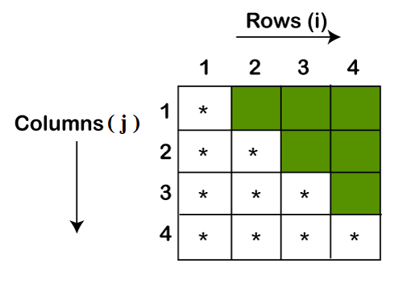

Java pattern program enhances the coding skill, logic, and looping concepts. It is mostly asked in Java interview to check the logic and thinking of the programmer. We can print a Java pattern program in different designs. To learn the pattern program, we must have a deep knowledge of the Java loop, such as for loop do-while loop. In this section, we will learn how to print a pattern in Java.

## **We have classified the Java pattern program into three categories:**
- Star Pattern
- Number Pattern
- Character Pattern

### **Here we explain each category with examples :**

## **Star Pattern :**

_**Qn1 : Right Triangle Star Pattern**_

### **Code :**
```java
public class RightTriangleStarPattern   
{   
    public static void main(String args[])   
    {   
        //i for rows and j for columns      
        //row denotes the number of rows you want to print  
        int i, j, row = 4;   
        //outer loop for rows  
        for(i=0; i<row; i++)   
        {   
            //inner loop for columns  
            for(j=0; j<=i; j++)   
            {   
                //prints stars   
                System.out.print("* ");   
            }   
            //throws the cursor in a new line after printing each line  
            System.out.println();   
        }   
    }   
}  
```
### **Output :**
```
*  
* *  
* * *  
* * * * 
```

### **Explanation & Approch of Solution :**
Whenever you design logic for a pattern program, first draw that pattern in the blocks, as we have shown in the following image. The figure presents a clear look of the pattern.




In the above pattern, the row is denoted by i and the column is denoted by j. We see that the first row prints only a star. The second-row prints two stars, and so on. The colored blocks print the spaces.

### **Iteration-1 :**
```
For i=0, 0<4 (true)
For j=0, j<=0 (true)
```
The first print statement prints a star at the first row and the second println statement prints the spaces and throws the cursor at the next line.

**Output Console :**
```
*
```

### **Iteration-2 :**
```
For i=1, 1<4 (true)
For j=1, 1<=1 (true)
```
The first print statement prints two stars at the second row and the second println statement prints the spaces and throws the cursor at the next line.

**Output Console :**
```
*
* *
```

### **Iteration-3 :**
```
For i=2, 2<4 (true)
For j=2, 2<=2 (true)
```
The first print statement prints three stars at the third row and the second println statement prints the spaces and throws the cursor at the next line.

**Output Console :**
```
*
* *
* * *
```

### **Iteration-4 :**
```
For i=3, 3<4 (true)
For j=3, 3<=3 (true)
```
The first print statement prints four stars at the fourth row and the second println statement prints the spaces and throws the cursor at the next line.

**Output Console :**
```
*
* *
* * *
* * * *
```
**Now the value of i and j is increased to 4.**

```
For i=4, 4<4 (false)
```
The execution of the program will terminate when the value of i will be equal to the number of rows.


## **Number Pattern :**

_**Qn1 : Right Triangle Number Pattern**_

### **Code :**
```java
public class RightTriangleNumberPattern   
{   
    public static void main(String[] args)
    {
        //i for rows and j for columns      
        //row denotes the number of rows you want to print  
        int i, j, row = 4;
        //outer loop for rows
        for (i = 1; i <= row; i++)
        {
            //inner loop for columns
            for (j = 1; j <= i; j++)
            {
                //print the current value of j
                System.out.print(j + " ");
            }
            //throws the cursor in a new line after printing each line
            System.out.println();
        }
    } 
}  
```
### **Output :**
```
1 
1 2 
1 2 3 
1 2 3 4 
```


## **Character Pattern :**

_**Qn1 : Right Triangle Character Pattern**_

### **Code :**
```java
public class RightTriangleCharacterPattern   
{   
    public static void main(String[] args)
    {
        //i for rows and j for columns      
        //row denotes the number of rows you want to print  
        int i, j, row = 4;
        //declear alphabet variable to print the value 
        int alphabet = 65;
        //outer loop for rows
        for (i = 1; i <= row; i++)
        {
            //inner loop for columns
            for (j = 1; j <= i; j++)
            {
                //print the current value of alphabet in character form
                System.out.print((char) alphabet + " ");
            }
            //increment the alphabet variable by 1
            alphabet++;
            //throws the cursor in a new line after printing each line
            System.out.println();
        }
    } 
}  
```
### **Output :**
```
A 
B B 
C C C 
D D D D 
```
<br>
Happy Learning 👍