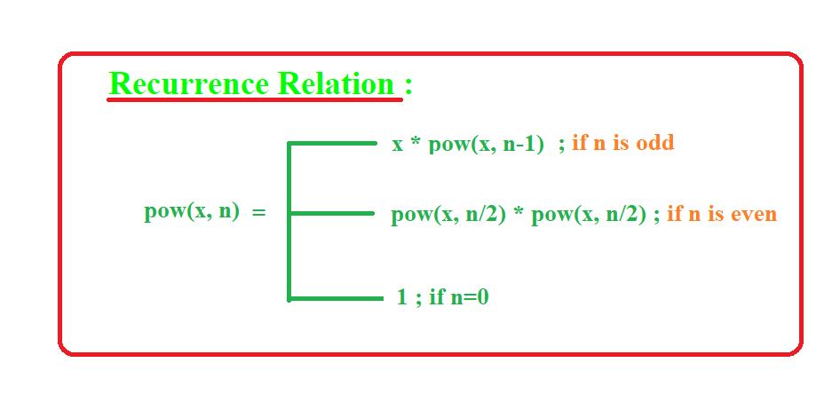
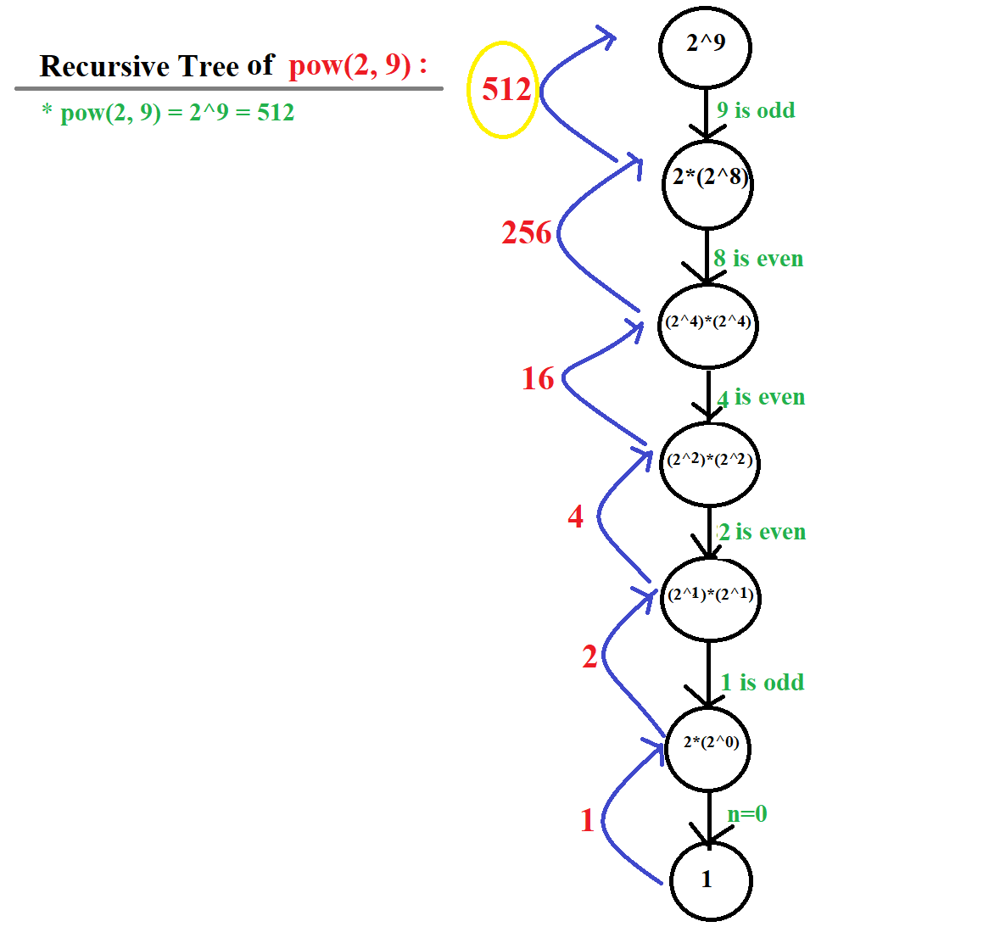

## **Q1 : Recursive Solution of Pow(x, n)**

Implement `pow(x, n)`

which calculates `x` raised to the power `n` i.e.  `x^n`

***Example 1:***
```
Input: x = 2, n = 9
Output: 512
```

***Example 2:***
```
Input: x = 5, n = 3
Output: 125
```

### **Solution & Approach :**
<center>

</center>

#### ***Rcursive Tree :*** For,  **pow(2, 9) = 2<sup>9</sup>**
<center>

</center>

### **Time Complexity : O(log(n))**

### **Code :**
```java
class PowerProgram {
    // power function
    public static int pow(int x, int n){
		if (n==0) return 1;
		else if(n%2==0) {
			int temp = pow(x, n/2);
			return temp*temp;
		}
		else return x*pow(x, n-1);
	}
    // Driver Code
    public static void main(String args[])
    {
        int n = 2, x = 9;
        int result = pow(n, x);
        System.out.print(result);
    }
}

```

### **Output :**
```
512
```

## **Q2 : Recursive program to find all Indices of a Number from an Array**

Given an array `arr` of size `N` and an integer `X`. The task is to find all the indices of the integer `X` in the array
Examples: 
 
```
Input: arr = {1, 2, 3, 2, 2, 5}, X = 2 
Output: 1 3 4 

As Element 2 is present at indices 1, 3, 4 (0 based indexing)
 ```

### **Solution & Approach :**
- If the start index reaches the length of the array, then return empty array

- Else keep the first element of the array with yourself and pass the rest of the array to recursion. 

- If the element at start index is not equal to x then just simply return the answer which came from recursion. 
 
- Else if the element at start index is equal to x then shift the elements of the array (which is the answer of recursion) one step to the right and then put the start index in the front of the array (which came through recursion) 

### **Code :**
```java
public class RecursiveFindIndices {
 
    public static int[] AllIndexesRecursive(int input[],
                                int x, int start)
    {
        // If the start index reaches the
        // length of the array, then
        // return empty array
        if (start == input.length) {
            int[] ans = new int[0]; // empty array
            return ans;
        }
 
        // Getting the recursive answer in
        // smallIndex array
        int[] smallIndex = AllIndexesRecursive(input, x,
                                              start + 1);
 
        // If the element at start index is equal
        // to x then
        // (which is the answer of recursion) and then
        // (which came through recursion)
        if (input[start] == x) {
            int[] myAns = new int[smallIndex.length + 1];
 
            // Put the start index in front
            // of the array
            myAns[0] = start;
            for (int i = 0; i < smallIndex.length; i++) {
                 
                // Shift the elements of the array
                // one step to the right
                // and putting them in
                // myAns array
                myAns[i + 1] = smallIndex[i];
            }
            return myAns;
        }
        else {
             
            // If the element at start index is not
            // equal to x then just simply return the
            // answer which came from recursion.
            return smallIndex;
        }
    }
 
    public static int[] AllIndexes(int input[], int x)
    {
 
        return AllIndexesRecursive(input, x, 0);
    }
     
    // Driver Code
    public static void main(String args[])
    {
        int arr[] = { 1, 2, 3, 2, 2, 5 }, x = 2;
         
        int output[] = AllIndexes(arr, x);
         
        // Printing the output array
        for (int i = 0; i < output.length; i++) {
            System.out.print(output[i] + " ");
        }
    }
}
```
### **Output :**
```
1 3 4
```


## **Q3 : Count Good Numbers**

A digit string is good if the digits (0-indexed) at `even` indices are `even` and the digits at `odd` indices are `prime` (2, 3, 5, or 7).

- For example, `2582` is good because the digits `(2 and 8)` at even positions are even and the digits `(5 and 2)` at odd positions are prime. However, `3245` is not good because `3` is at an even index but is not even.
Given an integer `n`, return the total number of good digit strings of length n. Since the answer may be large, return it modulo` 10^9+7`.

A digit string is a string consisting of digits 0 through 9 that may contain leading zeros.

***Example-1***
```
Input: n = 1
Output: 5
Explanation: The good numbers of length 1 are "0", "2", "4", "6", "8".
```
***Example-2***
```
Input: n = 50
Output: 564908303
```

### **Solution & Approach :**

### **Code :**
```java
class GoodNumber {
    static int mod=(int)1e9+7;
    public static int countGoodNumbers(long n) {
  
        if(n%2==0){
            long a= power(4,n/2);
            long b=power(5,n/2);
                  long z=a*b %mod;
                    return (int)(z);  
        }else{
              long a= power(4,n/2);
              long b=power(5,(n/2)+1);
               long z=a*b%mod;
                    return (int)(z);  
        }
    }
    // power function
    public static long power(long x,long y){ 
        long temp;
        if(y==0) return 1; 
        temp=power(x,y/2); 
        if(y%2==0) return (temp*temp)%mod;  
        else return (x*temp*temp)%mod; 
		 
    }
    // Driver Code
    public static void main(String args[])
    {
        int n = 1;
        int result = countGoodNumbers(n);
        System.out.print(result);
    }
}
```
### **Output :**
```
5
```


<br><br>
Happy Learning 👍
