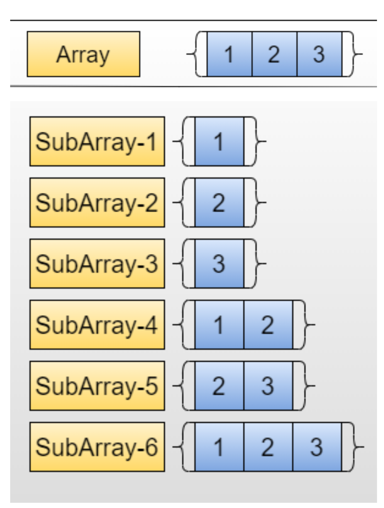

## Subarrays/Substrings

> A subarray is a contiguous part of array - An array that is inside another array. 
For eg., consider the array [1, 2, 3, 4], There are 10 non-empty sub-arrays in this. 
The subarrays are (1), (2), (3), (4), (1,2), (2,3), (3,4), (1,2,3), (2,3,4) and (1,2,3,4). 
In general, for an array/string of size n, there are n*(n+1)/2 non-empty subarrays/substrings.




### How to generate all subarrays? 
- We can run two nested loops
- The outer loop picks the starting element.
- The inner loop considers all elements on right of the picked starting element as ending element of subarray. 

```java
    class Test
    {
        static int arr[] = new int[]{1, 2, 3, 4};
         
        // Prints all subarrays in arr[0..n-1]
        static void subArray( int n)
        {
            // Pick starting point
            for (int i=0; i <n; i++)
            {
                // Pick ending point
                for (int j=i; j<n; j++)
                {
                    // Print subarray between current starting
                    // and ending points
                    for (int k=i; k<=j; k++)
                        System.out.print(arr[k]+" ");
                }
            }
        }
     
        // Driver method to test the above function
        public static void main(String[] args)
        {
            System.out.println("All Non-empty Subarrays");
            subArray(arr.length);
             
        }
    }
```
#####  Output -
All Non-empty Subarrays
1 
1 2 
1 2 3 
1 2 3 4 
2 
2 3 
2 3 4 
3 
3 4 
4
Time Complexity: O(n^2)  


### Generating subarrays using recursion
Input : [1, 2, 3]
Output : [1], [1, 2],[1,3], [2], [1, 2, 3], [2, 3], [3]

Input : [1, 2]
Output : [1], [1, 2], [2]

 

#### Approach
- We use two pointers, NAMELY, `start` and `end` to maintain the starting and ending point of the array and follow the steps given below: 
-- Stop if we have reached the end of the array
-- Increment the end index if start has become greater than end
-- Print the subarray from index start to end and increment the starting index.

Below is the implementation of the above approach.

```java
    class solution
    {
        // Recursive function to print all possible subarrays
        // for given array
        static void printSubArrays(int []arr, int start, int end)
        {    
            // Stop if we have reached the end of the array    
            if (end == arr.length)
                return;
             
            // Increment the end point and start from 0
            else if (start > end)
                printSubArrays(arr, 0, end + 1);
                 
            // Print the subarray and increment the starting point
            else
            {
                System.out.print("[");
                
                for (int i = start; i < end; i++){
                    System.out.print(arr[i]+", ");
                }
                 
                System.out.println(arr[end]+"]");
                printSubArrays(arr, start + 1, end);
            }
             
            return;
        }
         
        public static void main(String args[])
        {
            int []arr = {1, 2, 3};
            printSubArrays(arr, 0, 0);
        }
    }
```

#####  Output -

[1]
[1, 2]
[2]
[1, 2, 3]
[2, 3]
[3]
 

Time Complexity: O(n^2)   

