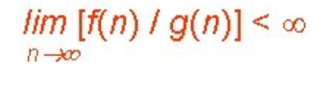
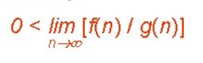
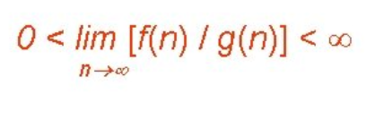
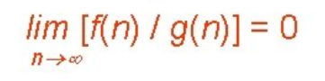
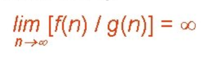

Time Complexity is a function / relationship that tells us how the time increases as input size increases. 

## Types of Notations:

### Big O Notation, O : 
- Word Definition - The notation Ο(n) is the formal way to express the strict upper bound of an algorithm's running time. It measures the worst case time complexity or the longest amount of time an algorithm can possibly take to complete.
- Mathematical Definition - 

If f(n) = O(g(n)), then there exists positive constants c, n0 such that 0 ≤ f(n) ≤ c.g(n), for all n ≥ n0, where f(n) are g(n) are asymptotic functions.

### Big Omega Notation, Ω : 
- Word Definition - The notation Ω(n) is the formal way to express the strict lower bound of an algorithm's running time. It is opposite of Big Oh notation. 
- Mathematical Definition -

If f(n) = Ω(g(n)), then there exists positive constants c, n0 such that 0 ≤ c.g(n) ≤ f(n), for all n ≥ n0

### Theta Notation, θ : 
- Word Definition - The notation θ(n) is the formal way to express both the lower bound and the upper bound of an algorithm's running time.
- Mathematical Definition -

If f(n) = Θ(g(n)), then there exists positive constants c1, c2, n0 such that 0 ≤ c1.g(n) ≤ f(n) ≤ c2.g(n), for all n ≥ n0

### Little O Notation, o : 
- Word Definition - The notation o(n) is the formal way to express the loose upper bound of an algorithm's running time.
- Mathematical Definition -

If f(n) = o(g(n)), then there exists positive constants c, n0 such that 0 ≤ f(n) < c.g(n), for all n ≥ n0

### Little Omega Notation, Ω : 
- Word Definition - The notation Ω(n) is the formal way to express the loose lower bound of an algorithm's running time.
- Mathematical Definition -

If f(n) = ω(g(n)), then there exists positive constants c, n0 such that 0 ≤ c.g(n) < f(n), for all n ≥ n0

NOTE : We use Big O and Big Omega notations mostly.

## Points to remember while calculating time complexity

- Consider larger inputs because relationship at this point persists.
- Constants are ignored since actual time even differs for the same relationship.
- Always ignore less dominating terms.
- Look for the worst case complexity - this will be what we consider the Big O of our algorithm/function

## Example

#### 1)  f(n) = 5n<sup>3</sup> + 4n + 3
Time Complexity - O(n<sup>3</sup>)

Explanation - Ignoring the less dominating terms we are left with 5n<sup>3</sup>. Now ignoring the constants, we get n<sup>3</sup>. And this is the time complexity.

#### 2)
```java
int sum = 0;
for(int i = 0; i < n; i++){
    for(int j = 0; j < n; j++){
        sum += i;
    }
}
```
Time Complexity - O(n<sup>2</sup>)

Explanation - Adding i to sum is constant time operation. And if we fix the value of i, we are traversing the inner loop n times. So, that means for a particular value of i, inner loop has O(n) complexity. And if we notice the outer loop, it is also traversing n times. So, total = n * n times and that is the time complexity.

## Guidelines for Asymptotic notation:

### Loops: 
The running time of a loop is, at most, the running time of the statements inside the loop,  multiplied number of iterations.
```java
for(int i = 0; i < n; i++){
    System.out.println(i);
}
```
Here, no of iterations are n and printing statement is a constant time operation. So, time complexity becomes O(n * 1) i.e. O(n).

### Nested Loops:
The total running time is the product of the sizes of all the loops.
```java
for(int j = 0; j < n; j++){
    for(int i = 0; i < n; i++){
        System.out.println(i);
    }
}
```
Here, outer loop is  traversing n times(each loop having complexity O(n) as explained earlier).So total becomes O(n * n). 

### Consecutive statements:
Add the time complexity of each statement. 
```java
int x = 0;
x += 1;
for(int i = 0; i < n; i++){
    System.out.println(i);
}
for(int j = 0; j < n; j++){
    for(int i = 0; i < n; i++){
        System.out.println(i);
    }
}
```
Here, the topmost two lines of code take 2 units of time(each statement takes 1 unit of time). The loop next to them executes n times(as explained earlier). The nested loop takes n<sup>2</sup> time. Hence,the total becomes  n<sup>2</sup> + n + 2. Ignoring less dominating terms and constants, final time complexity is O(n<sup>2</sup>).

### If-then-else statements:
The total running time is the the sum of time taken for checking the condition and the part(if or else) which takes the highest time. 
```java
int val = 12;
if(val < 18){
    for(int i = 0; i < n; i++){
        System.out.println(i);
    }
}
else{
    System.out.println(val);
}
```
Here, the first statement takes 1 unit of time. Then checking takes 1 unit of time.
"if" part takes n unit of time. "else" part takes 1 unit of time. Larger among "if" and "else" is "if" (i.e. n unit of time). 

So total = 1 + 1 + n = O(n<sup>2</sup>)

### Logarithmic Complexity:
It is achieved when the problem size is cut down by a fraction.
```java
for(int i = 1; i <= n;){
    i *= 2;
}
```
Here, in the first iteration, i = 1(i.e. 2<sup>0</sup>) <br />
             second         , i = 2(i.e. 2<sup>1</sup>) <br />
             third          , i = 4(i.e. 2<sup>2</sup>) <br />
             fourth         , i = 8(i.e. 2<sup>3</sup>) <br />
             ...</br>
             kth            , i = n(i.e. 2<sup>k - 1</sup>)

So, we need to find the no of interations i.e. the value of k = log<sub>2</sub>n + 1.
That means, time complexity will be O(log<sub>2</sub>n)

## Properties of Asymptotic Notation:

#### 1) Reflexivity:
If f(n) is given then, f(n) = O(f(n)).Example:If f(n) = n<sup>3</sup> ⇒ O(n<sup>3</sup>)
</br>
Similarly, f(n) = Ω(f(n)) and f(n) = Θ(f(n)).

#### 2) Symmetry:
f(n) = Θ(g(n)) if and only if g(n) = Θ(f(n)). Example:
If f(n) = n<sup>3</sup> and g(n) = n<sup>3</sup> then f(n) = Θ(n<sup>3</sup>) and g(n) = Θ(n<sup>3</sup>)

#### 3) Transistivity:
f(n) = O(g(n)) and g(n) = O(h(n)) ⇒ f(n) = O(h(n)). Example:
If f(n) = n, g(n) = n<sup>2</sup> and h(n) = n<sup>3</sup>
⇒ n is O(n<sup>2</sup>) and n<sup>2</sup> is O(n<sup>3</sup>) then n is O(n<sup>3</sup>)

#### 4) Transpose Symmetry:
f(n) = O(g(n)) if and only if g(n) = Ω(f(n)).
Example:
If f(n) = n and g(n) = n<sup>2</sup> then n is O(n<sup>2</sup>) and n<sup>2</sup> is Ω(n).
